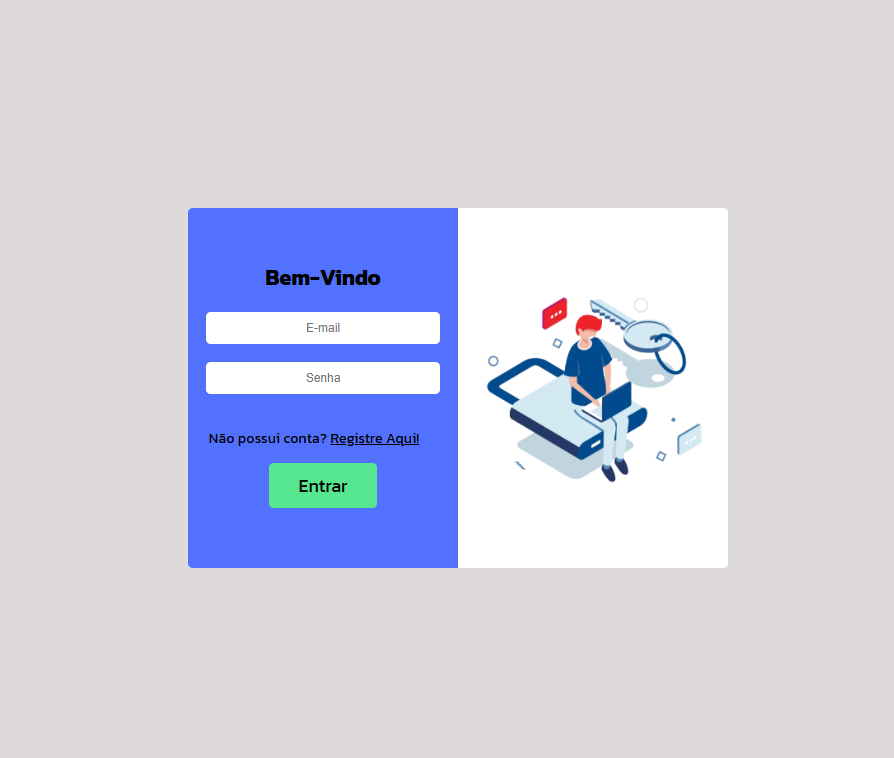

<h1 align="center">Tela de Login</h1>

Projeto para aprofundar meus conhecimentos e praticar os meus estudos como um Desenvolvedor da Web.

  <a href="#-tecnologias">Tecnologias</a>&nbsp;&nbsp;&nbsp;|&nbsp;&nbsp;&nbsp;
  <a href="#memo-licença">Licença</a>

  

 

  

## 🚀 Tecnologias

Esse projeto foi desenvolvido com as seguintes tecnologias:

- HTML e CSS
- JavaScript
- Git e Github

## 💻 Projeto

A "Tela de login" é um projeto para garantir que o usuário logue em sua conta com segurança e 
praticidade.

## 🔖

---

Feito com ♥ by Gabriel Martins de Souza
